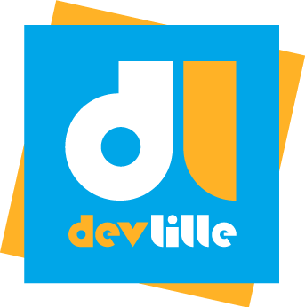

  

    

      DDD
    

    
HANDS-ON

  

  
From theory to practice

<!--
Are there any musicians in the room?

We love music and instruments, and today we are going to talk about an app we thought about: backstage

-->

---
src: ./pages/application.md
hide: false
---

---
src: ./pages/workshop.md
hide: false
---

---
src: ./pages/synthesis.md
hide: false
---

---
layout: image
image: ./assets/backgrounds/thankyou.svg
class: text-center
---

<h2>To go further</h2>

Resources 📜

Quiz ❓

François Blarel

Bastien Terrier

Thomas Smagghe

<!--
@Thomas - 1h28min

-->
